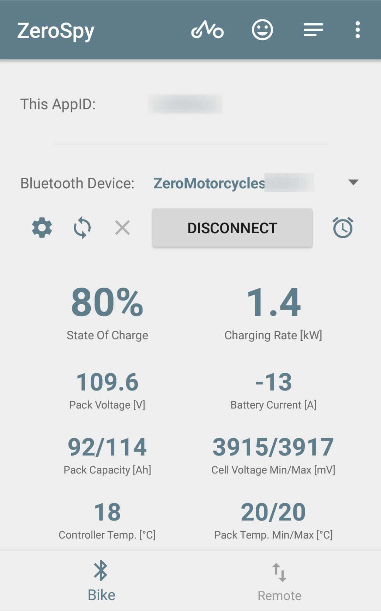
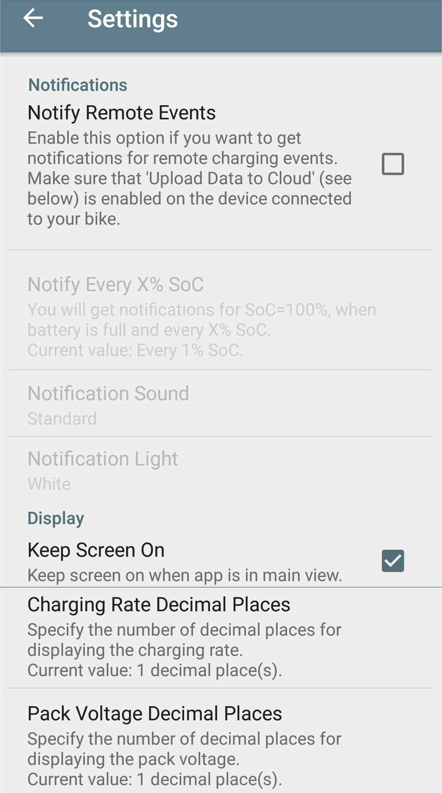
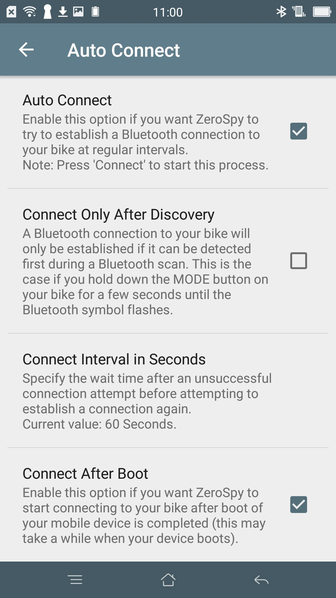
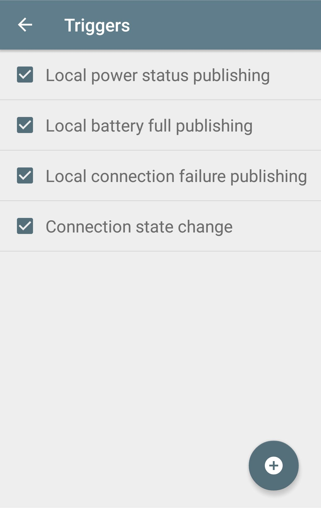
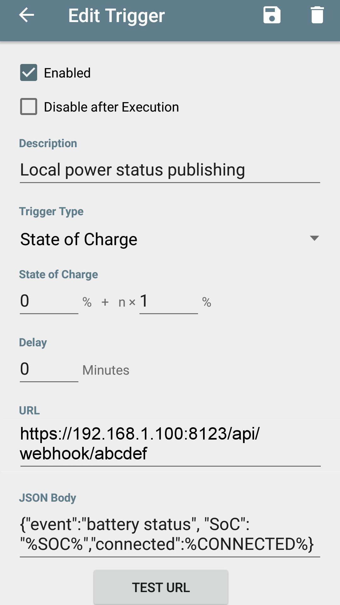
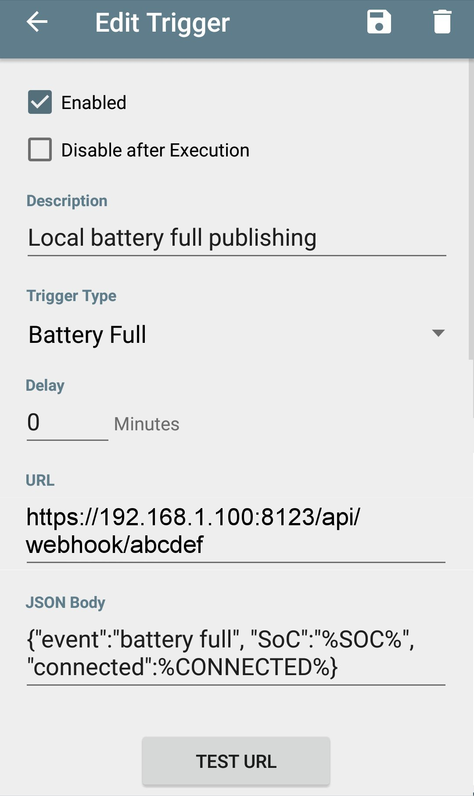
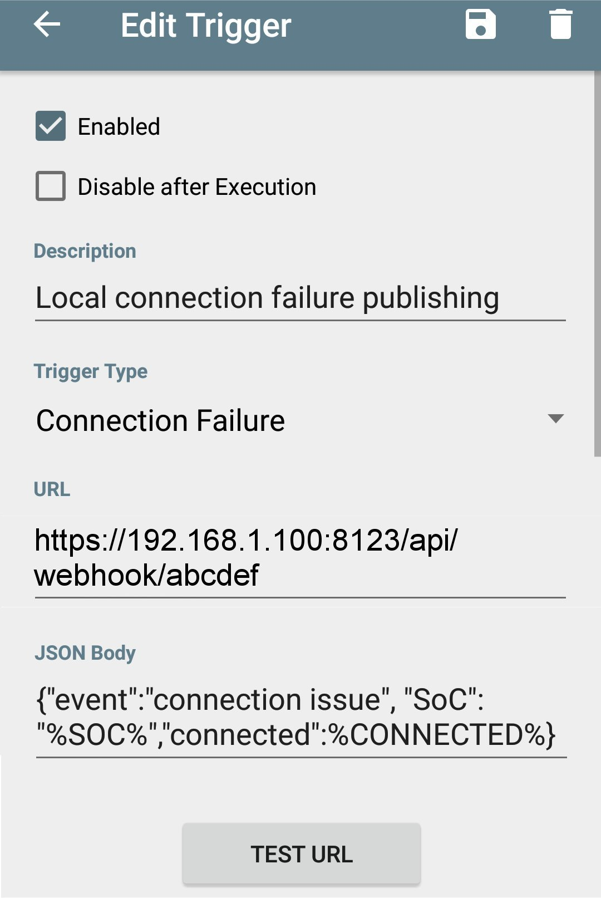
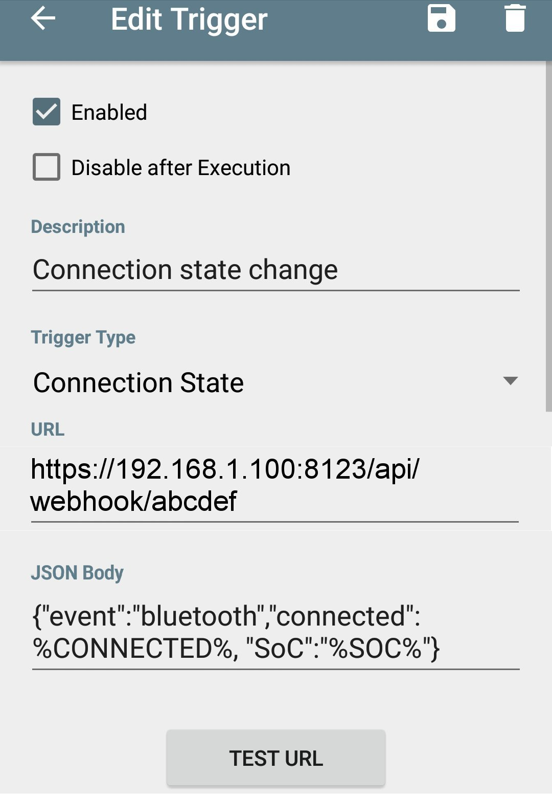

# monitored-zero-battery-charging
Monitor Zero battery charging from within Home Assistant with an old/unused Android phone.

Thanks to Boris Schaedler's <a href="https://play.google.com/store/apps/details?id=com.bsc101.zerospy">ZeroSpy</a> application, an old/unused Android phone can be repurposed into a Zero charging monitoring tool that can publish its info to a URL (I used thingspeak to send the information to the cloud and a REST sensor on Home Assistant to recover the information).  
Since February 28th, Boris added the ability to <b>post a JSON message</b> along with the called URL along with <b>new triggers</b>.
  This gives us much more control over what is actually happening during the charge but also allows us to publish that information locally to Home Assistant via a Webhook, without needing an Internet connection.

## Getting Started

### Prerequisites

#### Home Assistant
This guide aims at helping the Home Assistant enthusiasts but I guess webhooks must be available on pretty much any other platform.
#### Power relay
In order to control the charge of the battery based on the ZeroSpy information, I use a very compact 16A Blitzwolf BW-SHP1 power relay and the excellent <a href="https://www.zigbee2mqtt.io/">zigbee2mqtt</a>.

### Installation
Install the Zero Motorcycle app on your old Android phone and get it connected to the bike.
Then install ZeroSpy.

## ZeroSpy home screen
Connect ZeroSpy to your bike using Bluetooth and you should soon see your bike data appear on the screen:
 

## ZeroSpy configuration

### ZeroSpy general settings
In the settings, I left everything unchecked except <i>Keep Screen On</i>:
 

### ZeroSpy auto connect
In the auto connect menu (cogwheel on the main screen), I checked both <i>Auto Connect</i> and <i>Connect After Boot</i>: 
 

## The triggers
When the trigger condition is met, a URL can be called along with a JSON body.
I set 4 different triggers:
 

### Publish battery state change event
 
### Publish battery full event
 
### Publish connection failure event
 
### Publish connection change event
 

From here, ZeroSpy will issue POST calls with the requested information every time a trigger condition is met.

# Home Assistant
An easy way to recover information locally and securely is to use webhooks.
These tokens can be referenced in automations as triggers and the attached JSON data can be easily retrieved.

## How to create and ue webhooks in Home Assistant
Home assistant webhooks have to be called using the following URL type: 
https://<i>your home assistant instance</i>:<i>port</i>/api/webhook/<i>webhook id</i>
 where:
<pre>port: 8123 by default
webhook id: random hex number, up to 64 characters that will be used as trigger in an automation</pre>

## Generating the 64 character webhook id
On a Linux machine, you can easily generate a random token:
<pre>openssl rand -hex 32</pre>
Alternately, you can use Password Safe on Windows (Password policy tab - Password length: 64 characters, Use Hexadecimal digits only)

In my example as well as in the screenshots, I used a totally insecure but easy to type <i>abcdef</i> token.
Replace it by your own secure token in both the automation and ZeroSpy.

## The automation
Use the following yaml to retrieve the JSON information provided by ZeroSpy:
<pre>
  trigger:
    platform: webhook
    webhook_id: abcdef
  variables:
    what: "{{ trigger.json.event }}"
    soc: "{{ trigger.json.SoC }}"
    connected: "{{ trigger.json.connected }}"
    valid: "{{ not 'connection issue' in evenement }}"
</pre>

Have a look at <a href="./yaml/webhook.yaml">webhook.yaml</a> for a commplete automation example.

